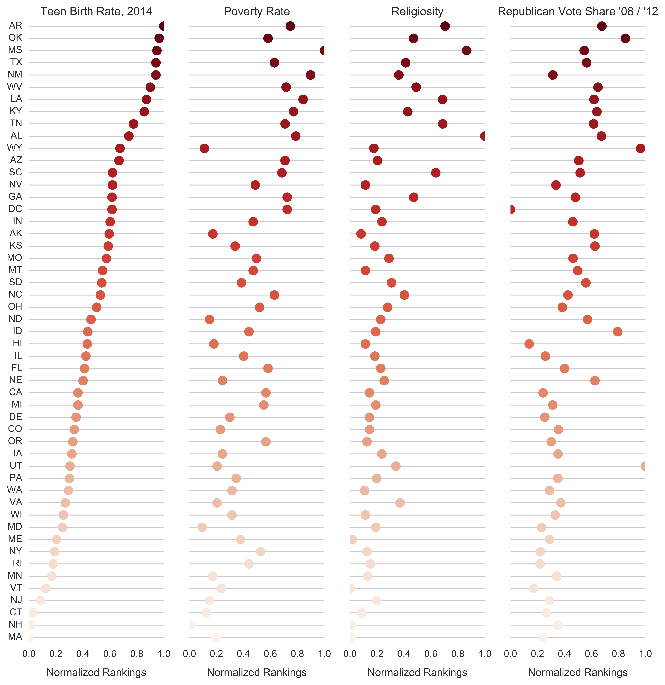

# Finding the Main Factors Affecting Teen Birth Rate
## Summary
This project looks at various socio-economic and political data to find factors that strongly effect the teen birth rate (15-19 year olds) for each state in the US. I aggregated, cleaned, and analyzed data factors related to religion, education, politics, poverty rate and median income, abortion rates for teens and overall, sexual education approaches, and race.

I attempted to find relationships between these explanatory variables using teen birth rate as the response for 51 samples (the 50 states + Washington DC). The importance of various features were selected using univariate selection methods (i.e. correlations), as well as various modeling techniques. The results were aggregated and final selection was made based on additive r-squared analysis.

## Key Questions Explored:
- Which factor(s) most strongly affect teen birth rate for the various states?
- With a reduced feature set, how much variance of the teen birth rate response can be explained?

## Techniques used:
- Univariate Feature Selection
- Ridge / Lasso / Mutual Info Regression
- Random Forest Feature Importance
- Boruta Feature Selection
- Adjusted R-Squared Analysis

## Key Findings:
- Poverty rate, religiosity, and political leanings in each state appears to have the strongest effect on teen birth rate.
- The plot below shows the normalized teen birth rate responses, as well as the normalized poverty rate, religiosity, and republican lean in the 2008 and 2012 elections. Darker red circles to the right indicate higher relative values of each respective category.

## Data Sources:
- Teen birth rates: https://www.hhs.gov/ash/oah/adolescent-development/reproductive-health-and-teen-pregnancy/teen-pregnancy-and-childbearing/trends/index.html
- Religiosity by state: http://www.pewforum.org/religious-landscape-study/state/california/#importance-of-religion-by-state
- GDP by state: https://en.wikipedia.org/wiki/List_of_U.S._states_by_GDP#cite_note-2
- Election results: https://en.wikipedia.org/wiki/United_States_presidential_election
- Population, Land area: http://www.ipl.org/div/stateknow/popchart.html
- Public education spending: http://www.governing.com/gov-data/education-data/state-education-spending-per-pupil-data.html
- Poverty rate: https://en.wikipedia.org/wiki/List_of_U.S._states_by_poverty_rate
- Median income by state: https://en.wikipedia.org/wiki/List_of_U.S._states_by_income
- Abortion rate by state: http://www.kff.org/womens-health-policy/state-indicator/abortion-rate/?currentTimeframe=0&sortModel=%7B%22colId%22:%22Location%22,%22sort%22:%22asc%22%7D
- Abortion percentage by age: http://www.kff.org/womens-health-policy/state-indicator/distribution-of-abortions-by-age/?currentTimeframe=0&sortModel=%7B%22colId%22:%22Location%22,%22sort%22:%22asc%22%7D
- Sex Education by state: https://www.guttmacher.org/state-policy/explore/sex-and-hiv-education
- Overall Sex Education Score from Graphiq: https://graphiq-stories.graphiq.com/stories/23028/states-worst-sex-education
- Population breakdown by race: http://www.kff.org/other/state-indicator/distribution-by-raceethnicity/?currentTimeframe=0&sortModel=%7B%22colId%22:%22Location%22,%22sort%22:%22asc%22%7D
